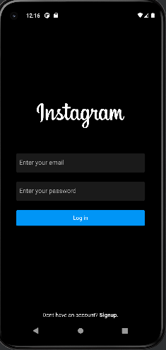
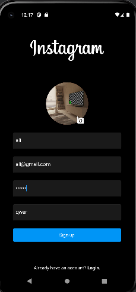
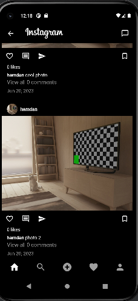
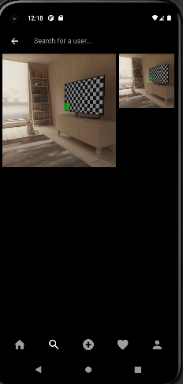
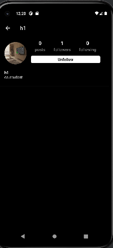
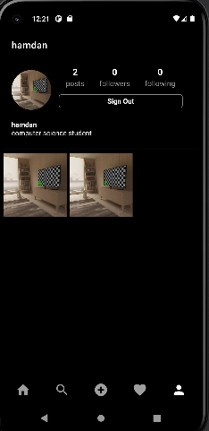

# instagram_clone

An instagram clone.

## Getting Started

In the final project of this fellowship, I built an instagram clone with all
the basic functionalities of instagram. 

## sample output

