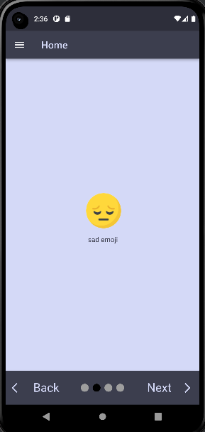
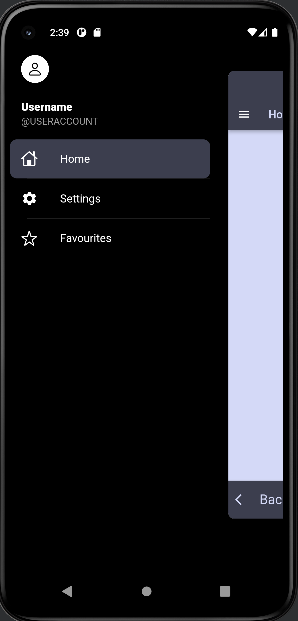
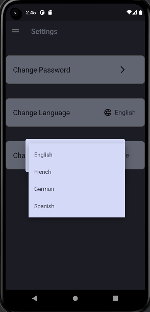

# week_10_tasks

An emoji app

## Explanation

In this week, I worked on the features of the favourite page of my emoji app.
The user can add any image to the favourites page just with the help of a 
button and also can delete the images from the favourite page. If there are
no images in the favourites page, the user can upload images with the help
of a button at the center of the page. If there are images already in the
favourite page, then the user can upload and delete images by clicking on 
the upload and delete buttons on the bottom right corner of the app respectively.
All the images are stored in sharedPreferences, so the images are preserved 
even when the user moves from one page to another or restarts the app.
 
## favourites page with no images

## favourites page with images

# Completion of emoji app

Thus, the emoji app is completed after 10 weeks of work.Here are all the
pages of the app with their explanations.

## Home page

This page contains four emojis each with a different animation.
Also there is a smooth page indicator that indicates the page currently being
accessed. The back and next buttons are used to move between the pages.

## side menu

This menu allows the user to navigate between pages of the app.

## settings page

This page allows the user to change settings such as password,language or location.

This is the menu for changing password.The user will have to write old password
(current password) correctly to decide the new password of the app.

This is the menu for changing language of the app.

This is the menu for changing the location of the app.

## Favourites page

The user can add his favourite images to the favourites page and these
images will be preserved. The user can add or delete images as discussed 
earlier.

