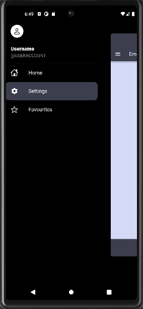

# emoji_app with animations

An emoji app with animations

# Explanation

In this week, I have made a directory called side_menu that contains side_menu.dart
file that shows the top icon, title, subtitle and a side_menu_title.dart file that shows                    
three tabs i.e Home, Settings and Favourites.Also I have used a dependency called 
hidden_drawer_menu to give a smooth animation between the sideMenu and different pages.
Currently I have designed only the HomePage but Settings and Favourites page will be added
in next week.

# sample output

