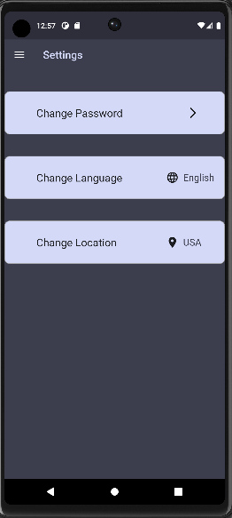

# week_7_tasks

An emoji app

## Explanation

In this week, I made some buttons of the setting page of our app. I made change password button
that allows you to change your password if u type your old password correctly. I made a location
button as well that allows the user to change his/her current location. I also made a change
language button that allows the user to select one out of four languages for his app.
I have made a class called settingPageTilesBuilder that makes a beautiful container for           
each button. Finally I have organized all these things along with an appbar in SettingsPage
widget that will display the setting page of my emoji app.

## sample output

