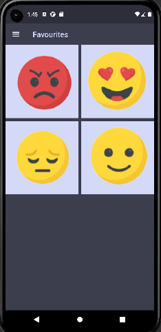

# week_8_tasks

An emoji app

## Explanation

In this week, I continue making developments on my emoji app as I have made
some progress on making the favourites page of my app. I learned how to
display images using grid view and I also changed the color of this page
according to the overall color scheme of the app. In the coming weeks, I 
will add some further features in this page and other pages of the app.

## sample output

