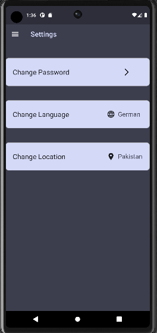

# week_9_tasks

An emoji app

## Explanation

In this week, I solved the state management problem of my emoji app.
I have used changeNotifier to update the user interface when language
or location is changed.This makes sure that the UI always remains updated
when the user navigates between different pages. Also with the help of
changeNotifier, password of the app is preserved when the user moves between
pages using the menu.

I have also used SharedPreferences to store data such as language,location and
password entered by the user for the app. This makes sure that the data is
preserved even when the app is shut down and restarted. Whenever the app is 
started, data (location,language and password) is fetched from sharedPreferences
so the data that user entered last time before closing the app is still
preserved and not wasted.
 
## sample output

